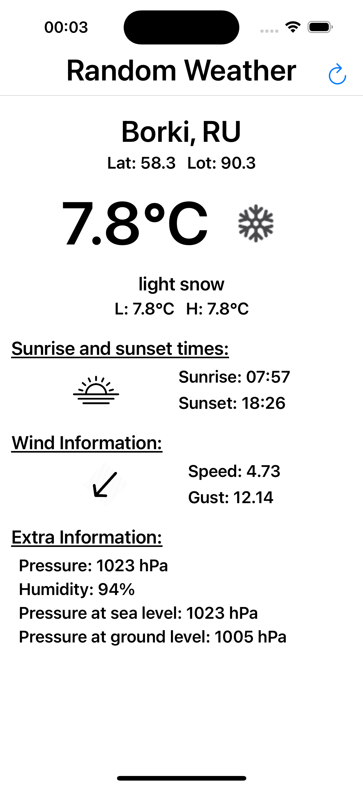
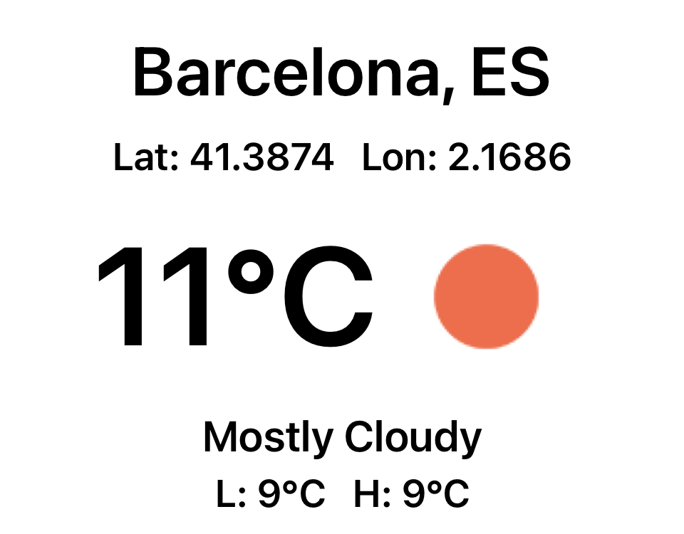
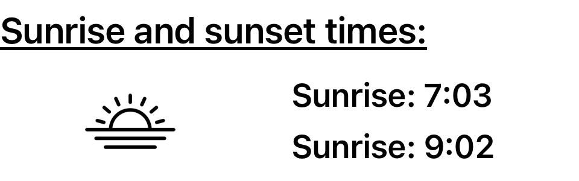
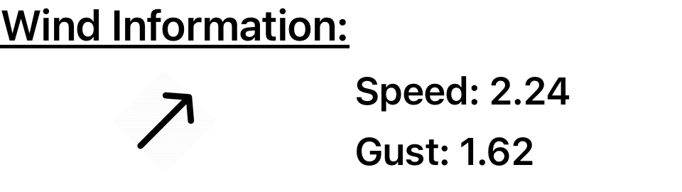
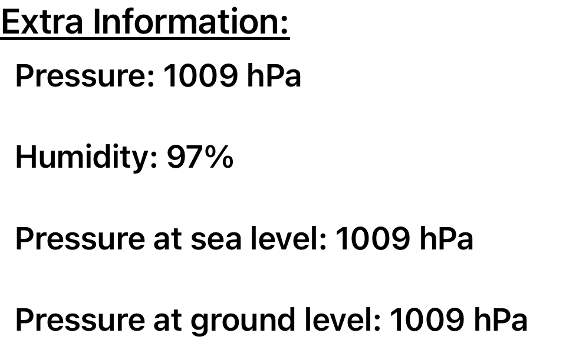

## RandomWeather **☀️**

RandomWeather is an iOS Application to get the weather data from a random location.

:warning: Please run "pod install" in order to get all the dependencies.

:warning: Requirements -  Use Xcode 13+ (iOS Deployment target is 15.0)

In this document i will give you an overview about the project.

## Description

The objective of this challenge is to display the weather of a random location defined by its latitude and longitude. In order to generate a random location, please take into account the requirements for valid latitude and a valid longitude.  
Weather information for a specific location can be obtained from the [http://openweathermap.org/current​](http://openweathermap.org/current​) API. The request will be done using the weather query by geographic coordinates: [https://openweathermap.org/current#geo​](https://openweathermap.org/current#geo​).

## Application overview :rocket:

### MainView - Weather Info Displayed

Once the application loads, you'll notice a loader because we are getting data from the endpoint.
After getting the data we are going to display it in some different views:

- Main Information:

- Sun Information:

- Wind Information:

- Extra Information:

You also have a NavigationBar with a title and a refresh button so you'll be able to get a new location and refresh the data.

## Architecture and implementation details

The application is written in Swift and designed using MVVM :heart: architecture with Apple's Combine.

The functionality is only in one scene:

- Main scene

Here is were weather data is displayed with multiple components and you can reload by tapping a button.

## Testing - Coverage is 89.9%

- ViewModel
- Mappers
- UseCases
- Snapshot Tests for all the views and cells

## Third party libraries

Main:
- SVProgressHUD - https://github.com/SVProgressHUD/SVProgressHUD (Loader)
- SnapKit - https://github.com/SnapKit/SnapKit (Constraints by code)
- Kingfisher https://github.com/onevcat/Kingfisher (Image loader and cache)

Test:
- Swift Snapshot Testing - https://github.com/pointfreeco/swift-snapshot-testing

## Support & contact

You can contact me via e-mail: carles828@gmail.com
